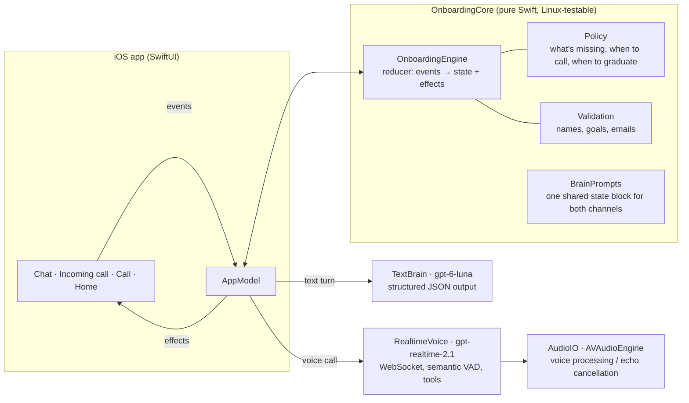

# Persona onboarding: adaptive voice + text

A native iOS (SwiftUI) take on Persona's onboarding. A brand-new assistant gets a **name** by text, then **calls you** to learn **your name**, **what you need help with**, and to **connect Gmail**. It keeps working when people don't follow the script: hang-ups, dropped calls, declined calls, no microphone, silence, answers out of order, changes of mind, refusals, prompt injection, and people who just want to skip ahead.

> Built for the Persona CTO trial by Ahmed Aymane Alexander El Jebari.

## Try it

- **iPhone:** TestFlight link (see the submission form).
- **From source:** open `PersonaOnboarding.xcodeproj` in Xcode 26+, add `PersonaOnboarding/Secrets.json` with `{"OPENAI_API_KEY": "sk-..."}` (or paste a key in the in-app **Tester tools**), then run on an iPhone or the Simulator (iOS 18+).
- **Tester tools** (the slider icon, top right) show the live onboarding state and let you break things on purpose: drop the call, pretend the mic is denied, call now, skip, or restart.

## How it works

- **One brain, two channels.** Chat and call read and write the same `OnboardingState`. The call transcript lands in the chat, so switching channels never loses anything and the agent never re-asks.
- **LLM for language, code for guarantees.** The model understands messy input and writes the replies; a deterministic `Policy` decides what's still missing, when to ring, and when someone may skip ahead. A model that says "we're done" early is overruled, and a name like `<script>` is rejected before it's stored.
- **Text turns are a single structured-output call.** Reply, extracted fields, intent and action come back in one JSON object, so there's no second round-trip for tool calls. There's a fallback model if the first one errors.
- **The voice call** uses the Realtime API over a WebSocket: semantic turn detection, live captions (`gpt-live-transcribe`), barge-in with truncation, function tools (`save_user_name`, `save_help_need`, `show_gmail_connect`, `mark_declined`, `rename_agent`, `finish_call`), and a spoken goodbye before hanging up. Tool results carry the next step, so the agent stays on track without a script.

### Resilience matrix

| What happens | What the agent does |
|---|---|
| Declines the call / taps "Message instead" | Continues in chat and never auto-calls again (the user can still tap the phone icon) |
| Doesn't pick up (22 s) | "Missed call" event, friendly nudge by text |
| Microphone denied | Explains once and continues by text |
| Hangs up mid-call | Keeps what it learned and continues by text with only what's missing |
| Network drops / app backgrounded / app killed | Treated as a dropped call; on relaunch the chat picks up and offers a call back (a drop during the goodbye counts as the planned ending) |
| Silence | Checks in after about 10 s ("Still with me?"); if it stays quiet, says it'll text instead, hangs up, and continues in chat |
| Talks over the agent | Playback stops instantly and the server is told what was actually heard |
| Taps Connect Gmail while the agent is still talking | Acknowledged right after the current sentence |
| Several answers at once / out of order | Extracts all of them |
| "Actually call me Sam" / "rename yourself Kai" | Overwrites |
| "I'm Leo" when asked to name the agent | Treated as the user's name; the agent still gets a name |
| Refuses Gmail or their name | Accepts it, stops asking, finishes without it |
| "Skip this, just let me in" | Asks at most for the one thing that matters (what they need), then lets them in; anything missing is collected later, just in time |
| Won't name the agent | Offers ideas, then picks a default ("Nova") that can be renamed |
| Off-topic, privacy questions | Short honest answer (grounded in a fixed privacy fact sheet), then steers back |
| Prompt injection / insults | Stays kind and in character, doesn't comply |
| Speaks French, Arabic, Spanish… | Replies in their language and stays in it on the call, even after English system messages (opening lines follow the device language) |

## Stress testing

Four layers, from pure logic to the real app:

1. **Unit tests** for the engine (19): call outcomes, idempotent hang-ups, corrections, refusals, early graduation, markup names, restored calls, language tracking, and more. Run `swift test`.
2. **Chat stress test:** an LLM plays 12 difficult personas against the real engine and brain, the harness plays the app (declines, drops, Gmail taps), and a judge model grades each transcript. Run `OPENAI_API_KEY=… swift run stress`.
3. **Voice call simulation with real audio:** `swift run callsim` drives `gpt-realtime-2.1` with the real engine, prompts and tools, using the same event handling as the app. LLM callers answer *out loud*: their lines go through OpenAI TTS and stream into the input buffer like a live mic, so turn detection, transcription, barge-in, silence and hang-ups all run for real. The 12 callers include an interrupter, someone who goes quiet, someone who hangs up, a Gmail refuser, a skipper, a French speaker, a privacy skeptic and a troll. It needs Node (`cd harness && npm install`).
4. **Autopilot caller in the app** (Tester tools → Autopilot caller): the same kind of AI caller talks to the agent through the real iOS audio path and UI, taps Connect Gmail, and continues by text if the call ends.

Latest results:

- **Chat:** all 12 personas finish with the right details, and 9/12 also clear the strict judge bar. Chat turns take about 1.8 s median.
- **Voice (audio simulation):** all 12 callers finish onboarding, with judge scores of 8–10 (median 10/10). The agent starts answering about 1 s (median) after the caller stops talking.
- **In the app (Simulator, Autopilot caller):** all 8 personas finish end to end through the real UI and audio path, in about 30–75 s per call.

## Design

"Midnight Glass": a living Metal orb with a face, editorial serif display type, hairline glass, and spring motion. See [DESIGN.md](DESIGN.md).

## Decisions and trade-offs

- **Native iOS over web.** A real phone-call feel (full-screen incoming call, haptic ring, echo-cancelled audio) matters for this product. The trade-off is distribution through TestFlight instead of a URL.
- **Realtime over WebSocket, not WebRTC.** No third-party WebRTC binary, full control of the audio graph, and simpler debugging.
- **Real Google sign-in, labels only.** The Gmail step is a real Google OAuth sign-in (authorization code + PKCE, no SDK) asking for basic identity plus `gmail.labels`. Google classes that scope as non-sensitive, so any account can connect without app verification, and the app reads the label list to prove the connection is live (the agent can mention one of your labels). Reading messages (`gmail.readonly`) is a restricted scope that needs Google's security assessment, which takes weeks, so it's the first production step. Builds without a Google client ID fall back to a clearly labeled demo connection.
- **Captions show the agent, not you.** The call screen captions the agent's exact words. The user's speech isn't echoed back live, because speech-to-text can mishear any word (names especially); the agent's reply already shows what it understood. The call transcript still lands in the chat, with the user's name corrected once it's saved.
- **API key in the build (gitignored `Secrets.json`).** Fine for a trial with a capped key. Production would mint short-lived realtime tokens from a small backend.

## What's next

- Google verification for `gmail.readonly`, then the first real task (an inbox triage preview) right after graduation.
- CallKit so the call rings like a real phone call, even from the lock screen.
- A server-side token service, per-user rate limits, and analytics on drop-off points.
- Evaluate `gpt-live-1` (full duplex) for the call and keep `gpt-realtime-2.1` for tool-heavy turns.

## Credits

Fonts: Geist and Instrument Serif (SIL Open Font License). Orb shader, sounds and icon: original to this project.
