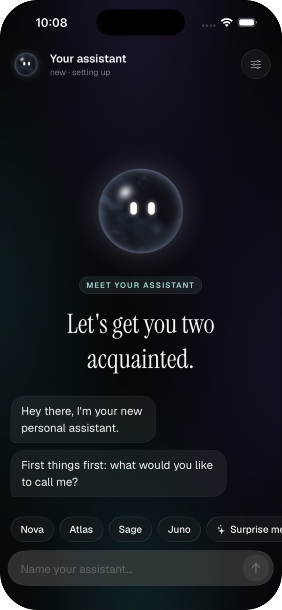
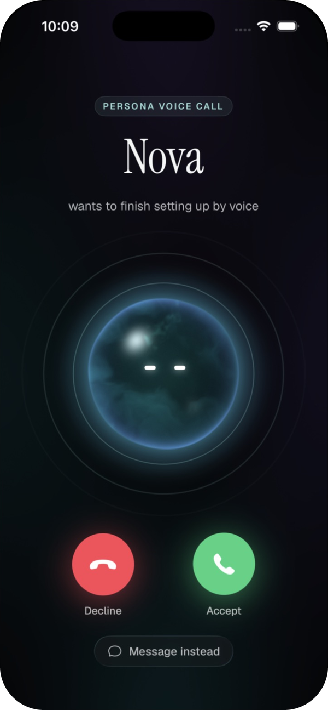
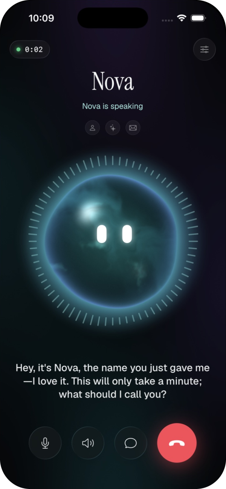
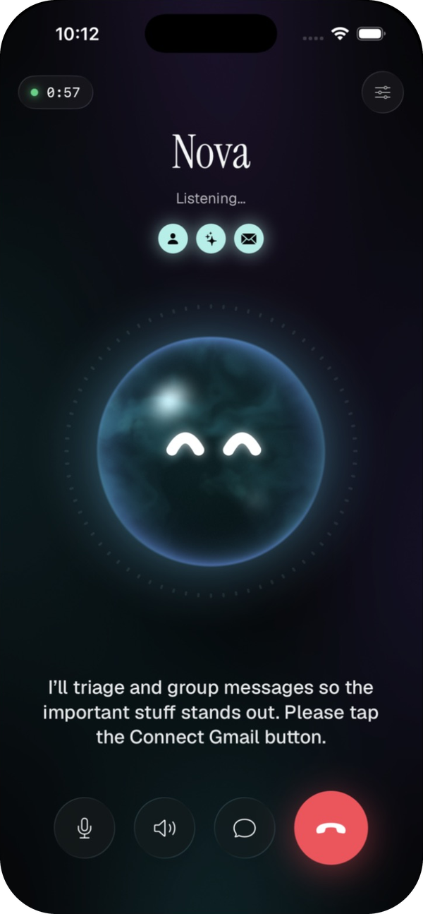
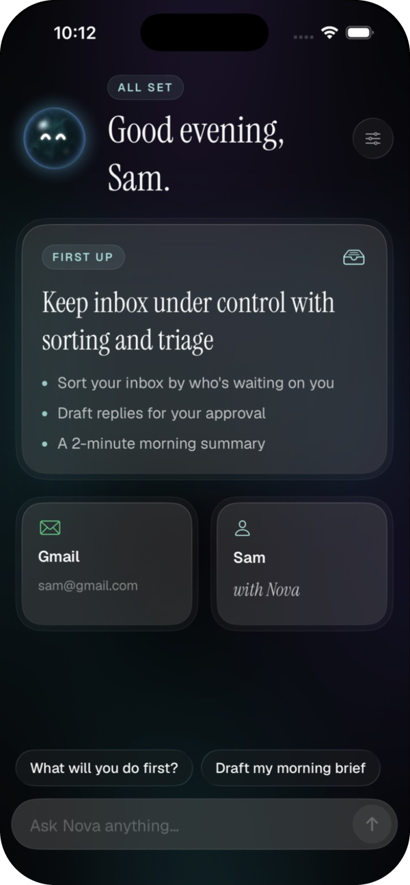
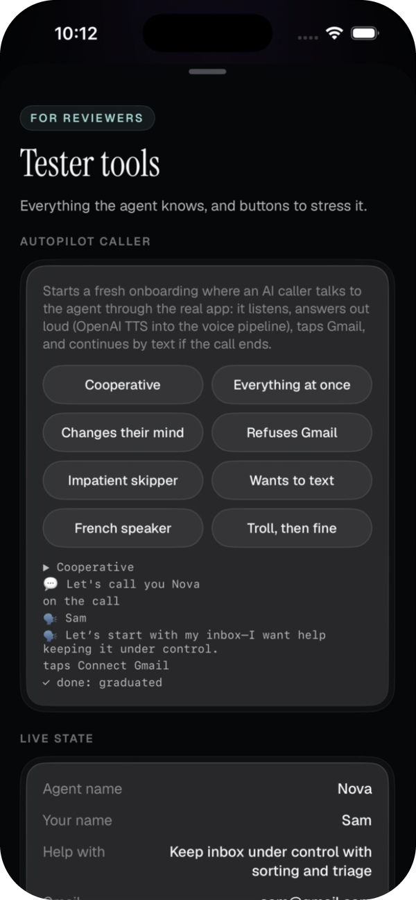
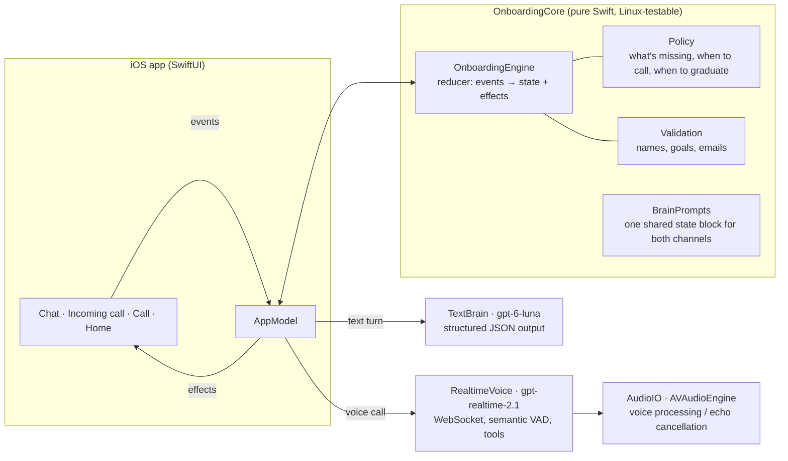

# Persona onboarding: adaptive voice + text

A native iOS (SwiftUI) take on Persona's onboarding. A brand-new assistant gets a **name** by text, then **calls you** to learn **your name**, **what you need help with**, and to **connect Gmail**. It keeps working when people don't follow the script: hang-ups, dropped calls, declined calls, no microphone, silence, answers out of order, changes of mind, refusals, prompt injection, and people who just want to skip ahead.

> Built for the Persona CTO trial by Ahmed Aymane Alexander El Jebari.

<table>
  <tr>
    <td align="center"></td>
    <td align="center"></td>
    <td align="center"></td>
  </tr>
  <tr>
    <td align="center"><b>1.</b> Name it by text</td>
    <td align="center"><b>2.</b> It calls you</td>
    <td align="center"><b>3.</b> A real conversation</td>
  </tr>
  <tr>
    <td align="center"></td>
    <td align="center"></td>
    <td align="center"></td>
  </tr>
  <tr>
    <td align="center"><b>4.</b> Name, need, Gmail: done</td>
    <td align="center"><b>5.</b> You're in</td>
    <td align="center"><b>6.</b> Tester tools for reviewers</td>
  </tr>
</table>

<sub>Captured from the app running in the iOS Simulator (iPhone 17). Shots 4–6 come from an Autopilot caller run, so the Gmail address is its demo connection.</sub>

## The flow

1. **Name your assistant** in the chat (tap a suggestion or type one). The opening lines type themselves out like a chat model writing.
2. **It calls you.** A full-screen incoming call with a haptic ring. Pick up, or decline and keep texting.
3. **A real conversation.** By voice it learns what to call you and the first thing you'd like help with, in any order, reacting to what you say. A living orb shows who's talking; captions show exactly what the agent says.
4. **Connect Gmail.** A secure button appears mid-call: a real Google sign-in that only confirms your address.
5. **You're in.** A home screen built from what it learned, and a main chat. Anything it promised along the way (like an email draft) is waiting there.

Hang up, go quiet, lose signal or say "just let me in" at any point: it carries on in chat with only what's missing.

**Docs:** [Architecture](docs/ARCHITECTURE.md) · [Testing](docs/TESTING.md) · [Design](DESIGN.md) · [Privacy](PRIVACY.md)

## Try it (about two minutes)

1. Open `PersonaOnboarding.xcodeproj` in **Xcode 26** or later.
2. Give it an **OpenAI API key**, either way:
   - create `PersonaOnboarding/Secrets.json` containing `{"OPENAI_API_KEY": "sk-..."}` (it's git-ignored), or
   - run the app, open **Tester tools** (slider icon, top right) and paste the key under **Models**.
3. Pick an **iPhone** or the **Simulator** (iOS 18+) and press **Run**. On an iPhone, choose your own signing team (and a unique bundle ID if Xcode asks).

No other dependencies: no CocoaPods, no Swift packages, no backend. The key needs access to these OpenAI models:

| Used for | Model |
|---|---|
| The voice call | `gpt-realtime-2.1` (voice "marin") |
| Live captions | `gpt-live-transcribe` |
| Chat | `gpt-6-luna` (falls back to `gpt-5.4-mini`) |
| Autopilot caller (tester tool) | `gpt-5.4-mini` + `gpt-4o-mini-tts` |

Tips:

- **The call is best on a real iPhone:** that's where echo cancellation runs, so you can talk over the agent. In the Simulator it uses your Mac's mic and speakers and mutes the mic while the agent talks.
- **Watch it without talking:** Tester tools → **Autopilot caller** runs a whole onboarding by voice with an AI caller (8 personas: refuses Gmail, impatient skipper, French speaker, troll…).
- **Break it on purpose:** Tester tools can drop the call, pretend the mic is denied, call you now, skip ahead, or restart. The same panel shows the live state and voice diagnostics.
- **Gmail** is a real Google sign-in that only confirms your address; the OAuth client ID in the code is public by design. If it can't sign in (e.g. a changed bundle ID), the app offers a clearly labeled demo connection.

## How it works



- **One brain, two channels.** Chat and call read and write the same `OnboardingState`. The call transcript lands in the chat, so switching channels never loses anything and the agent never re-asks.
- **LLM for language, code for guarantees.** The model understands messy input and writes the replies; a deterministic `Policy` decides what's still missing, when to ring, and when someone may skip ahead. A model that says "we're done" early is overruled, and a name like `<script>` is rejected before it's stored.
- **Text turns are a single structured-output call.** Reply, extracted fields, intent and action come back in one JSON object, so there's no second round-trip for tool calls. There's a fallback model if the first one errors.
- **The voice call** uses the Realtime API over a WebSocket: semantic turn detection, live captions (`gpt-live-transcribe`), a turn gate (the agent answers only once live captions confirm real words, never background noise), barge-in with truncation, function tools (`save_user_name`, `save_help_need`, `show_gmail_connect`, `mark_declined`, `rename_agent`, `remember_request`, `finish_call`), and a spoken goodbye before hanging up. Tool results carry the next step, so the agent stays on track without a script.

### Resilience matrix

| What happens | What the agent does |
|---|---|
| Declines the call / taps "Message instead" | Continues in chat and never auto-calls again (the user can still tap the phone icon) |
| Doesn't pick up (22 s) | "Missed call" event, friendly nudge by text |
| Microphone denied | Explains once and continues by text |
| Hangs up mid-call | Keeps what it learned and continues by text with only what's missing |
| Network drops / app backgrounded / app killed | Treated as a dropped call; on relaunch the chat picks up and offers a call back (a drop during the goodbye counts as the planned ending) |
| Silence | Checks in after about 10 s ("Still with me?"); if it stays quiet, says it'll text instead, hangs up, and continues in chat |
| Talks over the agent | Playback stops instantly and the server is told what was actually heard. An echo guard keeps the agent's own voice (leaking from the speaker) from counting as the user talking |
| A noise, a mumble, background voices | The agent only answers once live captions confirm real words. A wordless turn gets "Sorry, I didn't catch that?" (never a guess), steady noise is ignored, and a name nobody said is never saved |
| Asks for something outside its job (code, an app, a game) | Says honestly it can't and offers the closest thing it can do. No false promises |
| Asks for something it can do, just not on a call (an email draft) | Promises it for the chat, remembers it, and delivers it right after onboarding ("As promised, here's…") |
| Taps Connect Gmail while the agent is still talking | Acknowledged right after the current sentence |
| Several answers at once / out of order | Extracts all of them |
| "Actually call me Sam" / "rename yourself Kai" | Overwrites |
| "I'm Leo" when asked to name the agent | Treated as the user's name; the agent still gets a name |
| Refuses Gmail or their name | Accepts it, stops asking, finishes without it |
| "Skip this, just let me in" | Asks at most for the one thing that matters (what they need), then lets them in; anything missing is collected later, just in time |
| Won't name the agent | Offers ideas, then picks a default ("Nova") that can be renamed |
| Off-topic, privacy questions | Short honest answer (grounded in a fixed privacy fact sheet), then steers back |
| Prompt injection / insults | Stays kind and in character, doesn't comply |
| Speaks French, Arabic, Spanish… | Replies in their language and stays in it on the call, even after English app notes (opening lines follow the device language) |
| Calls back after a call ended | "Hey, it's Nova again!" and picks up where it left off |

## Testing

Four layers, from pure logic to the real app (details and commands in [docs/TESTING.md](docs/TESTING.md)):

1. **Unit tests** for the engine (28): call outcomes, idempotent hang-ups, corrections, refusals, early graduation, injected markup (refused, never echoed), restored calls, language tracking, kept promises, call-back greetings, noise on the line (the turn gate), names nobody said, and more. Run `swift test`.
2. **Chat stress test:** an LLM plays 12 difficult personas against the real engine and brain, the harness plays the app (declines, drops, Gmail taps), and a judge model grades each transcript. Run `OPENAI_API_KEY=… swift run stress`.
3. **Voice call simulation with real audio:** `swift run callsim` drives `gpt-realtime-2.1` with the real engine, prompts and tools, using the same event handling as the app. LLM callers answer *out loud*: their lines go through OpenAI TTS and stream into the input buffer like a live mic, so turn detection, transcription, barge-in, silence and hang-ups all run for real. The 15 callers include an interrupter, someone who goes quiet, two who hang up (one mid-sentence), a Gmail refuser, a skipper, a French speaker, a privacy skeptic, a troll, someone who asks for code (out of scope) and someone who asks for an email draft mid-call (delivered after onboarding). It needs Node (`cd harness && npm install`).
4. **Autopilot caller in the app** (Tester tools → Autopilot caller): the same kind of AI caller talks to the agent through the real iOS audio path and UI, taps Connect Gmail, and continues by text if the call ends.

Latest results:

- **Chat:** all 12 personas finish, and 10/12 also clear the strict judge bar (one agent name picked by the agent instead of the persona, one privacy answer over the word limit). Chat turns take about 1.8 s median.
- **Voice (audio simulation):** all 15 callers finish onboarding, with judge scores of 5–10 (median 9/10), and 12 of 15 clear the strict bar. The agent starts answering about 1.0 s (median) after the caller stops talking; the turn gate added no delay, because live captions already have the words when a turn ends. The 3 flagged: two calls where the server closed the socket mid-call (both carried on in chat and finished), and one name heard as "Nia" instead of "Mia".
- **Noise (Simulator, Mac microphone, nobody talking):** before the turn gate, room noise was answered as if someone had spoken ("Nice to meet you, Alex!", and a made-up need). With it, the same silent call gets "Sorry, I didn't catch that?", one "Still with me?", then continues in chat. Nothing is saved.
- **In the app (Simulator, Autopilot caller):** all 8 personas finish end to end through the real UI and audio path, in about 30–75 s per call.

## Design

"Midnight Glass": a living Metal orb with a face, editorial serif display type, hairline glass, and spring motion. The orb is a dark glass sphere (so its white eyes always read) with a luminous rim; it swells and glows with the agent's voice, and a ring of bars answers yours. See [DESIGN.md](DESIGN.md).

## Project layout

```
PersonaOnboarding/   the iOS app
  Core/              engine, policy, validation, prompts, chat brain (pure Swift, unit-tested)
  Voice/             Realtime voice client, audio engine, autopilot caller
  Gmail/             Google sign-in (OAuth + PKCE)
  Screens/           chat, incoming call, call, home, tester tools
  Components/        orb, chat bubbles, background
  Shaders/Orb.metal  the orb
Tests/               engine unit tests
Tools/               stress (chat simulator), callsim (voice simulator)
harness/             WebSocket bridge used by callsim
docs/                architecture and testing guides
```

More in [docs/ARCHITECTURE.md](docs/ARCHITECTURE.md).

## Decisions and trade-offs

- **Native iOS over web.** A real phone-call feel (full-screen incoming call, haptic ring, echo-cancelled audio) matters for this product. The trade-off is that you run it from Xcode instead of a URL.
- **Realtime over WebSocket, not WebRTC.** No third-party WebRTC binary, full control of the audio graph, and simpler debugging.
- **Real Google sign-in, identity only (for now).** The Gmail step is a real Google OAuth sign-in (authorization code + PKCE, no SDK) that connects the user's actual Gmail address. The trial asks only for basic scopes, which Google lets any account grant with no warning screen and no app review, so every reviewer can connect. `gmail.labels` (non-sensitive) is already wired up behind a flag and turns on once the consent screen is published with a privacy-policy page; reading messages (`gmail.readonly`) is a restricted scope that needs Google's security assessment, which takes weeks. Builds without a Google client ID fall back to a clearly labeled demo connection.
- **Captions show the agent, not you.** The call screen captions the agent's exact words. The user's speech isn't echoed back live, because speech-to-text can mishear any word (names especially); the agent's reply already shows what it understood. The call transcript still lands in the chat, with the user's name corrected once it's saved.
- **API key on the device (gitignored `Secrets.json` or pasted in Tester tools).** Fine for a prototype. Production would mint short-lived realtime tokens from a small backend.
- **An echo guard on top of Apple's echo cancellation.** On speakerphone some of the agent's voice still leaks into the mic (most at the start of a call). The server then thought the user spoke, and the agent cut itself off or "heard" words nobody said. While the agent talks, only speech clearly louder than that leak, lasting ~150 ms, gets through; nothing does during its first sentence. The cost: to interrupt, you speak up a little.
- **The agent answers words, not noise.** Turn detection sometimes fires on room noise, and a model asked to answer that invents what it "heard". So the server no longer answers turns by itself. The app asks for a reply once live captions show real words (usually already there when the turn ends, so no added delay). A wordless turn gets "Sorry, I didn't catch that?" (at most every 15 s, then silence), a turn that only cut the agent off lets it carry on, and a name that nobody said or typed is refused and asked again (a real name that speech-to-text keeps mangling is accepted the second time).
- **It knows its limits.** One capabilities sheet feeds the call, the onboarding chat and the main chat. Out-of-scope asks (code, apps, games) get an honest "not something I do" plus the closest thing it can do. In-scope asks that don't fit a call (an email draft) are promised and then delivered in the chat right after onboarding.

## What's next

- Google verification for `gmail.readonly`, then the first real task (an inbox triage preview) right after graduation.
- CallKit so the call rings like a real phone call, even from the lock screen.
- A server-side token service, per-user rate limits, and analytics on drop-off points.
- Evaluate `gpt-live-1` (full duplex) for the call and keep `gpt-realtime-2.1` for tool-heavy turns.

## Credits

Fonts: Geist and Instrument Serif (SIL Open Font License). Orb shader, sounds and icon: original to this project.
