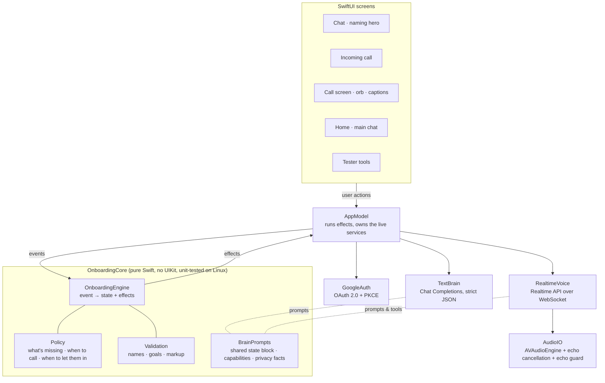

# Architecture

How the onboarding works under the hood: one shared state, a deterministic engine, and two language models (one for chat, one for the voice call) that only ever do the talking.

## The big picture



Everything the product "decides" lives in `OnboardingCore`. The app layer only performs side effects (ring the phone, open a socket, call a model, play a sound) and feeds the results back in as events.

## State and phases

`OnboardingState` is a single `Codable` value, persisted to `UserDefaults` after every event, so a relaunch (or a crash mid-call) resumes exactly where the user was.

| Phase | Meaning |
|---|---|
| `naming` | Chat. The assistant needs a name (always by text first). |
| `onCall` | The phone is ringing or the call is live. |
| `textFollowUp` | The call ended (declined, dropped, hung up, silence…); chat finishes whatever is missing. |
| `graduated` | Onboarding is over; the home screen and main chat take over. |

What's collected: `agentName`, `userName`, `helpNeed` (+ category), `gmail`, plus `declined` fields the user refused. Nothing is ever asked twice: every prompt receives the same state block listing what's known, what's declined and what's still needed.

## Engine: events in, effects out

`OnboardingEngine.handle(_ event:) -> [OnboardingEffect]` is a reducer. Examples:

| Event | Typical effects |
|---|---|
| `textBrainReplied(turn)` | save extracted fields, show the reply, maybe `ring`, `showGmailConnect` or `graduate` |
| `callConnected` | voice instructions are built from the current state |
| `voiceToolCall(name, args, id)` | update the profile, `voiceToolResult` (with the next step), `refreshVoiceInstructions` |
| `callEnded(reason)` | `disconnectVoice`, an event line in the chat, `runTextBrain` with a note tailored to the reason |
| `gmailConnected(connection)` | tell the agent privately (voice) or the chat brain (text); the next turn wraps up if everything is in |
| `skipRequested` | `graduate` if the policy allows, otherwise ask only for what matters |

Because it's pure, the engine is covered by unit tests (`swift test`) and reused by both simulators, so the harnesses exercise the exact production logic.

## Policy: code decides, the model talks

`Policy` answers the questions a model shouldn't be trusted with:

- **What's still needed?** `stillNeeded(profile)`, in a fixed priority order.
- **When do we ring?** `canAutoCall`: exactly once, right after the assistant gets its name, and only if something conversational is still missing (Gmail alone is just a button). The user can always ask for a call later (`canUserCall`).
- **When can they skip ahead?** `canGraduate`: once there's a name and a help need. A model that says "we're done" early is overruled; a user who insists twice is let in anyway.
- **What should the model do next?** `textDirective` (chat) and `voiceNextStep` (call) are one-line steering instructions that stay correct even if the user's last message already answered the question.

## The chat brain

`TextBrain` makes one Chat Completions call per turn (`gpt-6-luna`, falling back to `gpt-5.4-mini` on errors) with a **strict JSON schema**: `reply`, `agent_name`, `user_name`, `help_need`, `help_category`, `intent`, `action`, `remember_request`. One round-trip gives the reply and the structured extraction, so there are no tool-call loops in chat.

The engine then applies guarantees on top of the model output: names go through `Validation.cleanName` (no markup, code, URLs or junk), a reply that tries to adopt an injected name is replaced, and HTML tags are never rendered.

## The voice call

`RealtimeVoice` speaks the OpenAI Realtime API (`gpt-realtime-2.1`, voice `marin`) over a WebSocket.

- **Turn-taking:** server-side `semantic_vad` with barge-in; noise reduction is `far_field` on speakerphone and `near_field` on a headset.
- **Turn gate** (`TurnGate`, `PendingTurns`): the server doesn't answer turns by itself (`create_response: false`). Room noise sometimes trips turn detection, and a model asked to answer it invents what it "heard" ("Nice to meet you, Alex!" with nobody talking). The app requests a reply only once live captions show real words for the turn; they usually already do when the turn is committed, so this adds no delay. A turn with no words (or the multilingual gibberish speech-to-text produces for unintelligible audio) is deleted from the conversation and gets "Sorry, I didn't catch that?" (rate-limited), a "carry on" if it only cut the agent off, or nothing if it's steady noise (it then doesn't reset the silence timers). If speech-to-text fails or takes over 1.5 s, the voice model is trusted.
- **Names nobody said:** `save_user_name` is refused if the name (or a close spelling, a spelled-out version, or a same-sounding one) doesn't appear in anything the user said or typed, including the live caption of the current turn; the agent corrects itself and asks again. A name proposed again after the user has spoken is accepted, so a real name that speech-to-text keeps mangling can't get stuck.
- **Captions:** `gpt-live-transcribe`, primed with the agent's name and likely names so it hears "Ayman" rather than "amen"; the agent's own words are captioned from its exact output.
- **Tools** (silent to the user): `save_user_name`, `save_help_need`, `rename_agent`, `show_gmail_connect`, `mark_declined`, `remember_request`, `finish_call`. Every tool result carries `still_needed` and `next`, so the agent stays on track without a script.
- **Barge-in:** when the user talks over the agent, playback stops instantly and the server is told how much was actually heard (`conversation.item.truncate`).
- **App notes:** things the agent must know but must not mention ("the Google sign-in screen is open", "Gmail is connected", "the line has been quiet") are injected as private system messages, queued if the agent is mid-sentence.
- **Endings:** `finish_call` asks for one real spoken goodbye and hangs up once it has played. Silence gets a check-in at ~10 s and a spoken "I'll text you" at ~24 s. Tapping End catches the user's last words first (commit + wait up to 1.5 s for the transcript) so the chat never re-asks. A drop during the goodbye still counts as the planned ending.

### Audio

`AudioIO` runs full duplex on `AVAudioEngine` with Apple's voice processing (echo cancellation). It's built to never go silent:

- a fresh engine for every call;
- on a hardware change (speaker toggle, Bluetooth, route change, media reset) it restarts or rebuilds the engine and **replays the part of the agent's sentence that hadn't been heard yet**;
- a watchdog restarts an engine that stopped rendering;
- if echo cancellation keeps failing on a device, it falls back to half-duplex (mic gated while the agent speaks);
- route, output peak, rebuilds, echo-guard counts and chunk counters are shown in Tester tools → Models.

**Echo guard.** On speakerphone some of the agent's voice leaks back into the mic even with echo cancellation, most at the start of a call while the canceller adapts. Sent as-is, the server thought the user had spoken: the agent cut itself off and sometimes "heard" words nobody said. So while the agent talks, only speech that is clearly louder than the measured leak, and lasts ~150 ms, reaches the server (with its held-back onset sent first). During the agent's first sentence nothing gets through. The trade-off: to interrupt, you speak up a little.

The orb's motion is driven by the loudness of the audio **actually being played** (a 40 ms loudness timeline built when chunks are scheduled), so it reacts even if output metering isn't available.

## Gmail

`GoogleAuth` implements "Sign in with Google" without an SDK: authorization code flow with PKCE through `ASWebAuthenticationSession`, a reversed-client-ID redirect, token exchange, and an ID-token decode for the email and first name. The trial requests only `openid email profile`, which any Google account can grant without a warning screen or app review. `gmail.labels` is wired up behind a flag for when the consent screen is published; reading mail (`gmail.readonly`) needs Google's security assessment. If sign-in isn't possible, a clearly labeled demo connection keeps the flow going.

## Prompts

`BrainPrompts` builds every prompt from the same pieces, so chat and call can't drift apart:

- a **state block** (what's known, declined, still needed, the user's language);
- a **capabilities sheet**: what the assistant is for (inbox, emails, calendar, planning, reminders, research…) and a short list of what it doesn't do (code, apps/games, purchases, medical/legal/financial advice). Out-of-scope asks get an honest "not something I do" plus the closest alternative; in-scope asks that don't fit a call are promised via `remember_request` and delivered in the chat right after onboarding;
- a fixed **privacy fact sheet** so data questions get the same honest answer every time;
- channel rules: short spoken turns, invisible tools, no narration, speak the user's language, say "didn't catch that" instead of guessing, never invent a name.

## Where things live

```
PersonaOnboarding/
  App/          AppModel (effects, services), app entry
  Core/         OnboardingEngine, Policy, Validation, TurnGate, BrainPrompts, TextBrain, models (pure Swift)
  Voice/        RealtimeVoice (Realtime API), AudioIO (audio engine), AutopilotCaller, SoundFX
  Gmail/        GoogleAuth (OAuth + PKCE), GmailConnectSheet
  Screens/      RootView (chat), CallViews (incoming call, call), HomeView, TesterPanel
  Components/   AgentOrb (+ WaveRing), chat bubbles, aurora background
  Shaders/      Orb.metal (the orb)
  Design/       Theme, glass styles
Tests/          engine unit tests
Tools/          stress (chat simulator), callsim (voice simulator)
harness/        Node WebSocket bridge used by callsim on Linux
```
